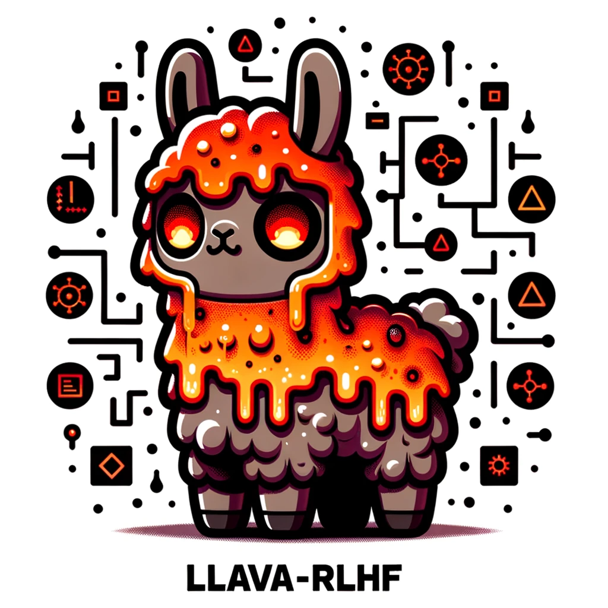

<div align="center">
    
<p>Generated by <a href="https://openai.com/dall-e-3">DALL·E 3</a></p>
</div>

<div align="center">

<!-- # LLaVA-RLHF -->

# LLaVA-RLHF: Aligning Large Multimodal Models with Factually Augmented RLHF

</div>

[[Project Page / Demo / Model Weights](https://llava-rlhf.github.io/)]

LLaVA-RLHF represents the first open-source **RLHF-trained** large multimodal model for general-purpose visual and language understanding, achieving impressive visual reasoning and perception capabilities. For comprehensive details and insights, we kindly direct you to our [project page](https://llava-rlhf.github.io/) and [paper](https://arxiv.org/abs/2309.14525).

## Inference

To deploy or play with our model, please refer to [the demo directory](./demo).

## Train

We propose a new alignment algorithm called **Factually Augmented RLHF (Fact-RLHF)** that augments the reward model with additional factual information such as image captions and ground-truth multi-choice options, which alleviates the reward hacking phenomenon in RLHF and further improves the performance.

LLaVA-RLHF is trained on 8 A100 GPUs with 80GB memory. To train on fewer GPUs, you can reduce the `per_device_train_batch_size` and increase the `gradient_accumulation_steps` accordingly. Always keep the global batch size the same: `per_device_train_batch_size` x `gradient_accumulation_steps` x `num_gpus`.

The SFT training pipeline is provided in [the SFT directory](./SFT), and the RLHF training pipeline is provided in [the RLHF directory](./RLHF).

## Examples

<div align="center">
    
</div>

<div align="center">
    
</div>

## Citations

If you find this repo useful for your research, please consider citing the paper

LLaVA-RLHF:

```bibtex
@article{sun2023aligning,
  title={Aligning large multimodal models with factually augmented rlhf},
  author={Sun, Zhiqing and Shen, Sheng and Cao, Shengcao and Liu, Haotian and Li, Chunyuan and Shen, Yikang and Gan, Chuang and Gui, Liang-Yan and Wang, Yu-Xiong and Yang, Yiming and others},
  journal={arXiv preprint arXiv:2309.14525},
  year={2023}
}
```

LLaVA:

```bibtex
@misc{liu2023llava,
      title={Visual Instruction Tuning},
      author={Liu, Haotian and Li, Chunyuan and Wu, Qingyang and Lee, Yong Jae},
      publisher={arXiv:2304.08485},
      year={2023},
}
```

SALMON:

```bibtex
@article{sun2023salmon,
  title={SALMON: Self-Alignment with Principle-Following Reward Models},
  author={Sun, Zhiqing and Shen, Yikang and Zhang, Hongxin and Zhou, Qinhong and Chen, Zhenfang and Cox, David and Yang, Yiming and Gan, Chuang},
  journal={arXiv preprint arXiv:2310.05910},
  year={2023}
}
```

## Acknowledgements

We thank [Meta LLaMA team](https://github.com/facebookresearch/llama), [Standford Alpaca team](https://github.com/tatsu-lab/stanford_alpaca), [Vicuna team](https://github.com/lm-sys/FastChat), [LLaVA team](https://github.com/haotian-liu/LLaVA), [QLoRA team](https://github.com/artidoro/qlora), [Hugging Face PEFT](https://github.com/huggingface/peft), and [AlpacaFarm team](https://github.com/tatsu-lab/alpaca_farm) for their open-source efforts in democratizing large language models.
